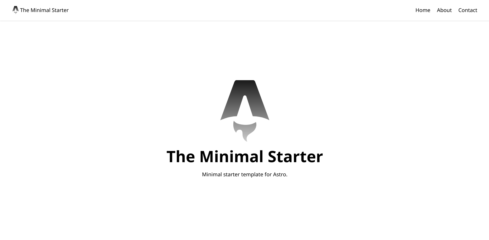

# Astro Starter Kit: Mini



Start your new Astro project by running.

```sh
npm create astro@latest -- --template vfshera/astro-templates/packages/mini
```

OR

```sh
pnpm create astro@latest --template vfshera/astro-templates/packages/mini
```
